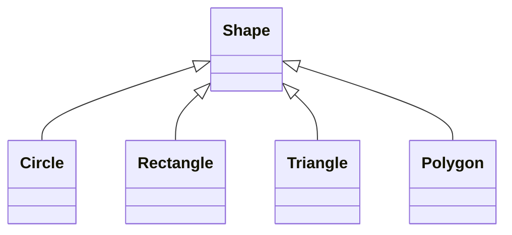

# test/complex/include/spatial/shapes.hpp

## Structures

### `spatial::AABB`

```c
struct spatial::AABB {
    unknown min;
    unknown max;
};
```

An axis-aligned bounding box (AABB)

**Fields:**
- `min` (unknown): Minimum corner (bottom-left)
- `max` (unknown): Maximum corner (top-right)

---

## Classes

### `spatial::Shape&lt;T&gt;`

#### Inheritance Diagram



```cpp
template<typename T>
class spatial::Shape {
};
```

Abstract base class for 2D shapes

**See also:** `Circle, Rectangle, Triangle, Polygon`

**Template Parameters:**
- `T` (typename): The scalar type

---

### `spatial::Circle&lt;T&gt;`

**Inherits from:** [Shape](../types/shapes.md#spatial::shape)&lt;T&gt; (public)

#### Inheritance Diagram

```mermaid
classDiagram
    class Circle
    class Shape
    Shape<T> <|-- Circle
```

```cpp
template<typename T>
class spatial::Circle : public Shape<T> {
public:
    void Circle(Point2<T> center, T radius);
    T radius() const;
    void set_center(const Point2<T> center);
    void set_radius(T radius);
    T area() const;
    T perimeter() const;
    bool contains(const Point2<T> p) const;
    void bounding_box() const;
    void centroid() const;
    void transformed(const Transform2<T> transform) const;
    bool intersects(const Circle other) const;
private:
    unknown center_;
    T radius_;
};
```

A circle defined by center and radius

**See also:** `Shape, AABB`

**Template Parameters:**
- `T` (typename): The scalar type

**Public Methods:**

- `Circle(Point2&lt;T&gt;, T)`: Constructs a circle from center and radius
- `radius()`: Gets the radius
- `set_center(const Point2&lt;T&gt;)`: Sets the center point
- `set_radius(T)`: Sets the radius
- `area()`: Computes the area (π * r²)
- `perimeter()`: Computes the circumference (2 * π * r)
- `contains(const Point2&lt;T&gt;)`: Checks if a point is inside the circle
- `bounding_box()`: Gets the bounding box
- `centroid()`: Gets the centroid (same as center for a circle)
- `transformed(const Transform2&lt;T&gt;)`: Creates a transformed copy
- `intersects(const Circle)`: Checks if this circle intersects another

---

### `spatial::Rectangle&lt;T&gt;`

**Inherits from:** [Shape](../types/shapes.md#spatial::shape)&lt;T&gt; (public)

#### Inheritance Diagram

```mermaid
classDiagram
    class Rectangle
    class Shape
    Shape<T> <|-- Rectangle
```

```cpp
template<typename T>
class spatial::Rectangle : public Shape<T> {
public:
    void Rectangle(Point2<T> center, T width, T height);
    void Rectangle(const AABB<T> box);
    T width() const;
    T height() const;
    T area() const;
    T perimeter() const;
    bool contains(const Point2<T> p) const;
    void bounding_box() const;
    void centroid() const;
    void transformed(const Transform2<T> transform) const;
    void corners() const;
private:
    unknown center_;
    T width_;
    T height_;
};
```

An axis-aligned rectangle

**See also:** `Shape, AABB`

**Template Parameters:**
- `T` (typename): The scalar type

**Public Methods:**

- `Rectangle(Point2&lt;T&gt;, T, T)`: Constructs a rectangle from center, width, and height
- `Rectangle(const AABB&lt;T&gt;)`: Constructs a rectangle from an AABB
- `width()`: Gets the width
- `height()`: Gets the height
- `area()`: Computes the area (width * height)
- `perimeter()`: Computes the perimeter (2 * (width + height))
- `contains(const Point2&lt;T&gt;)`: Checks if a point is inside the rectangle
- `bounding_box()`: Gets the bounding box (same as the rectangle for axis-aligned)
- `centroid()`: Gets the centroid
- `transformed(const Transform2&lt;T&gt;)`: Creates a transformed copy
- `corners()`: Gets the four corner points

---

### `spatial::Triangle&lt;T&gt;`

**Inherits from:** [Shape](../types/shapes.md#spatial::shape)&lt;T&gt; (public)

#### Inheritance Diagram

```mermaid
classDiagram
    class Triangle
    class Shape
    Shape<T> <|-- Triangle
```

```cpp
template<typename T>
class spatial::Triangle : public Shape<T> {
public:
    void Triangle(Point2<T> a, Point2<T> b, Point2<T> c);
    T area() const;
    T perimeter() const;
    bool contains(const Point2<T> p) const;
    void bounding_box() const;
    void centroid() const;
    void transformed(const Transform2<T> transform) const;
    bool is_degenerate() const;
private:
    unknown vertices_;
};
```

A triangle defined by three vertices

**See also:** `Shape, Polygon`

**Template Parameters:**
- `T` (typename): The scalar type

**Public Methods:**

- `Triangle(Point2&lt;T&gt;, Point2&lt;T&gt;, Point2&lt;T&gt;)`: Constructs a triangle from three vertices
- `area()`: Computes the area using the cross product formula
- `perimeter()`: Computes the perimeter (sum of edge lengths)
- `contains(const Point2&lt;T&gt;)`: Checks if a point is inside using barycentric coordinates
- `bounding_box()`: Gets the bounding box
- `centroid()`: Gets the centroid (average of vertices)
- `transformed(const Transform2&lt;T&gt;)`: Creates a transformed copy
- `is_degenerate()`: Checks if the triangle is degenerate (zero area)

---

### `spatial::Polygon&lt;T&gt;`

**Inherits from:** [Shape](../types/shapes.md#spatial::shape)&lt;T&gt; (public)

#### Inheritance Diagram

```mermaid
classDiagram
    class Polygon
    class Shape
    Shape<T> <|-- Polygon
```

```cpp
template<typename T>
class spatial::Polygon : public Shape<T> {
public:
    void Polygon(std::vector<Point2<T>> vertices);
    void Polygon(std::initializer_list<Point2<T>> vertices);
    usize vertex_count() const;
    T signed_area() const;
    T area() const;
    T perimeter() const;
    bool contains(const Point2<T> p) const;
    void bounding_box() const;
    void centroid() const;
    void transformed(const Transform2<T> transform) const;
    bool is_convex() const;
private:
    unknown vertices_;
};
```

A general polygon defined by a list of vertices

**See also:** `Shape, Triangle`

**Template Parameters:**
- `T` (typename): The scalar type

**Public Methods:**

- `Polygon(std::vector&lt;Point2&lt;T&gt;&gt;)`: Constructs a polygon from a list of vertices
- `Polygon(std::initializer_list&lt;Point2&lt;T&gt;&gt;)`: Constructs a polygon from an initializer list
- `vertex_count()`: Gets the number of vertices
- `signed_area()`: Computes the signed area using the shoelace formula
- `area()`: Computes the area (absolute value of signed area)
- `perimeter()`: Computes the perimeter (sum of edge lengths)
- `contains(const Point2&lt;T&gt;)`: Checks if a point is inside using ray casting
- `bounding_box()`: Gets the bounding box
- `centroid()`: Gets the centroid
- `transformed(const Transform2&lt;T&gt;)`: Creates a transformed copy
- `is_convex()`: Checks if the polygon is convex

---

